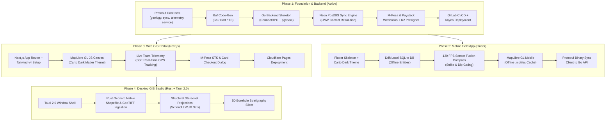

Ai should not change this file. this file will be used in review and verification that the AI built what it was instructed.


# 🗺️ GeoQuerry — Master Project Plan, Progress & Architecture Guide

> **Current Status**: Phase 1 — Backend core implemented (sync engine, LWW conflicts, live telemetry hub)  
> **Repository**: `austin4403/geo-querry`  
> **Target Platforms**: Mobile (iOS & Android), Desktop Studio (Linux, macOS, Windows), Web GIS Portal  
> **Author & Lead**: Austin  
> **Last Updated**: September 2026

---

## 1. What Are We Doing?

### The Mission
Geological exploration, mineral concession management, hydrogeology, and borehole drilling frequently happen in the most remote areas on Earth (e.g., the East African Rift, remote mining blocks, bush exploration camps) where cellular connectivity is intermittent or completely non-existent.

**GeoQuerry** is an **offline-first, cross-platform geological intelligence and field exploration platform**. It replaces fragile paper notebooks, fragmented handheld GPS units, manual Brunton compass recordings, and siloed desktop software with a unified spatial workflow:

1. **In the Bush (Zero Signal)**:
   - Field geologists capture structural orientation (**Strike, Dip, Trend, Plunge**) directly on their phones using 120 FPS hardware sensor fusion (accelerometer + magnetometer) with automated stability gating.
   - Geologists log outcrop stations, rock samples (with local photos), borehole lithology intervals, and vegetation indicators.
   - All spatial records are indexed locally in SQLite with vector map rendering (`.mbtiles`) without requiring any network connection.

2. **At Camp or Base (Low Bandwidth / 2G / Satellite / Starlink)**:
   - The device syncs bidirectionally using binary **Protocol Buffers** (reducing payload size by ~75% vs JSON).
   - High-resolution sample and vegetation photos are uploaded directly to **Cloudflare R2** with zero egress fees via secure presigned URLs.
   - Background telemetry streams live team coordinates and battery statuses when online.

3. **In the Office / Exploration HQ**:
   - Exploration managers view concessions and live geologist tracks on the **Web GIS Portal** (MapLibre GL JS Carto Dark Matter theme).
   - Lead geoscientists open **Desktop GIS Studio** (Rust + Tauri 2.0) to slice massive multi-gigabyte shapefiles, plot structural stereonets, and render 3D borehole log stratigraphy without browser memory limits.
   - Dual-currency billing handles subscriptions via **Safaricom M-Pesa STK Push (KES)** for local African operations and **Paystack / Stripe (USD/Cards)** globally.

---

## 2. Tech Stack Blueprint

### A. Universal Data Contract Layer
* **Protocol Buffers (Proto3)**: Canonical definition for all domain entities, sync payloads, and streaming telemetry (`proto/geoquerry/v1/*.proto`).
* **Buf**: Protobuf linting, breaking change detection, and multi-language code generation (`buf.yaml`, `buf.gen.yaml`).
* **ConnectRPC / gRPC**: High-performance binary transport compatible with HTTP/1.1, HTTP/2, gRPC-Web, and standard REST clients.

### B. Backend Cloud API
* **Language**: Go (Golang 1.23+)
* **RPC Framework**: Connect-Go (`connectrpc.com/connect`) & standard `net/http` / Chi router
* **Database Driver**: `jackc/pgx/v5` with connection pooling
* **Object Storage**: AWS SDK for Go v2 configured for Cloudflare R2 (S3-compatible presigned PUT/GET)
* **Real-time Telemetry Hub**: Goroutines + WebSockets / SSE backed by Upstash Redis pub/sub
* **Payment Gateways**:
  - **Safaricom Daraja API**: Lipa Na M-Pesa Online (C2B / STK Push) in KES with Daraja cryptographic signature verification
  - **Paystack / Stripe API**: Card and international billing with webhook signature validation
* **Deployment Runtime**: Single compiled static Go binary in a scratch / alpine container deployed on **Koyeb Eco Nano** (Always-on, 512 MB RAM, $0/mo).

### C. Database & Spatial Infrastructure
* **Engine**: PostgreSQL 16+ on **Neon Serverless Postgres** ($0/mo tier)
* **Spatial Extension**: **PostGIS 3.4+**
* **Key Spatial Types**:
  - `GEOMETRY(PointZ, 4326)`: Outcrop stations and borehole collar coordinates with elevation
  - `GEOMETRY(MultiPolygon, 4326)`: Concession boundaries and exploration claims
* **Indexing**: Spatial `GIST` indexes on all geometry columns, composite indexes on `(project_id, updated_at)` for delta-sync queries.

### D. Mobile Field App (Field Geologist Tool)
* **Framework**: Flutter 3.x (Dart) targeting iOS & Android
* **Hardware Sensors**: `sensors_plus` consuming accelerometer and magnetometer streams at 120 FPS; complementary/kalman filtering to compute strike, dip, trend, plunge with tilt compensation and visual stability indicator.
* **Local Persistence**: **Drift (type-safe SQLite)** with migration handling, dirty entity tracking (`is_dirty`, `synced_at`), and Last-Write-Wins (LWW) conflict resolution.
* **Offline Mapping**: `maplibre_gl` (Flutter) loading offline `.mbtiles` packages containing vector contours, satellite basemaps, and geological boundary layers.
* **Serialization**: Dart Protobuf runtime for high-density, low-bandwidth data transfers.

### E. Web GIS Portal (Management & Concession Portal)
* **Framework**: Next.js 15+ (App Router) + TypeScript
* **Styling**: Tailwind CSS v4 with custom **Carto Dark Matter** GIS theme (`#09090b` obsidian background, `#10b981` emerald telemetry accents, `#2563eb` electric cobalt controls).
* **Map Engine**: MapLibre GL JS + `@maplibre/maplibre-gl-inspect`
* **Real-Time Feed**: Server-Sent Events (SSE) / WebSocket connecting to Go live telemetry stream to display active geologists on concessions.
* **Hosting**: **Cloudflare Pages** ($0/mo, global edge network).

### F. Desktop GIS Studio (Heavyweight Workstation)
* **Shell**: Tauri 2.0 (Rust)
* **Native Rust Processing Engine**:
  - `geozero` & `geo`: Fast spatial geometry manipulation, shapefile/GeoTIFF ingestion.
  - `polars`: High-throughput tabular crunching for dense drillhole assay CSVs and LAS borehole logs.
  - Native stereonet generator (Wulff & Schmidt net projections) and cross-section interpolation.
* **Frontend**: Shared React/Next.js UI components running in Tauri webview with native IPC bridge.

### G. Zero-Cost Infrastructure Matrix ($0.00 / month)
| Service | Provider | Free Tier Allocation | Role |
| :--- | :--- | :--- | :--- |
| Monorepo & CI/CD | GitLab Free | 400 CI/CD mins/month + Registry | Version control, Docker container build & registry |
| Spatial Database | Neon Postgres | 0.5 GiB storage, PostGIS enabled | Canonical relational and spatial database |
| Blob / Photo Storage | Cloudflare R2 | 10 GB free, $0 egress fees | Sample outcrop and vegetation photos |
| Web Portal Hosting | Cloudflare Pages | Unlimited bandwidth, automatic builds | Web GIS interface |
| Backend Compute | Koyeb Eco Nano | 512 MB RAM, 0.1 vCPU, always-on | Go API and sync server |
| Telemetry Pub/Sub | Upstash Redis | 10,000 commands/day free | Ephemeral field team coordinate hub |

---

## 3. Monorepo Folder Structure

```
geo-querry/
├── .git/                                # Git version control
├── .gitlab-ci.yml                       # GitLab CI/CD pipeline (Test, Build Docker, Deploy Koyeb)
├── GEOQUERRY_SYSTEM_DESIGN.md           # Master System Architecture & Specifications
├── PROJECT_PLAN.md                      # This document: Plan, progress, folder structure, tech stack
├── README.md                            # High-level repository entrypoint
│
├── proto/                               # Universal Protobuf Contracts
│   ├── buf.yaml                         # Buf v2 module configuration
│   ├── buf.gen.yaml                     # Buf code-gen config (Go, Dart, TypeScript)
│   └── geoquerry/
│       └── v1/
│           ├── geology.proto            # Stations, Measurements, Samples, Boreholes, Concessions, Vegetation
│           ├── sync.proto               # PushSyncQueue & PullProjectData delta payloads
│           ├── telemetry.proto          # Real-time GPS, heading, battery, and speed streaming
│           └── service.proto            # GeoquerrySyncService RPC definitions
│
├── backend/                             # Compiled Go Backend Microservice
│   ├── Dockerfile                       # Multi-stage scratch/alpine container build
│   ├── go.mod                           # Go module definition
│   ├── go.sum                           # Go dependencies checksum
│   ├── cmd/
│   │   └── server/
│   │       └── main.go                  # Server entrypoint (HTTP/ConnectRPC listener, graceful shutdown)
│   ├── internal/
│   │   ├── config/                      # Environment variables and config loading
│   │   ├── db/
│   │   │   ├── db.go                    # pgxpool connection manager for Neon PostGIS
│   │   │   └── migrations/
│   │   │       └── 000001_init.sql      # PostGIS tables, GIST indices, foreign keys
│   │   ├── sync/
│   │   │   ├── service.go               # PushSyncQueue & PullProjectData RPC business logic
│   │   │   └── conflict.go             # LWW (Last-Write-Wins) timestamp resolution
│   │   ├── telemetry/
│   │   │   ├── hub.go                   # Real-time geologist location pub/sub & stream fanout
│   │   │   └── upstash.go               # Upstash Redis client integration
│   │   ├── mpesa/
│   │   │   ├── daraja.go                # Safaricom Lipa Na M-Pesa STK push initiator
│   │   │   └── webhook.go               # Daraja payment callback verification
│   │   ├── paystack/
│   │   │   ├── client.go                # Paystack transaction verification & checkout
│   │   │   └── webhook.go               # Paystack signature check & tier provisioning
│   │   └── r2/
│   │       └── presigner.go             # Cloudflare R2 S3 presigned PUT/GET generator
│   └── pkg/
│       └── proto/                       # Generated Go Protobuf & ConnectRPC code
│           └── geoquerryv1/
│
├── mobile/                              # Flutter Cross-Platform Field App (iOS & Android)
│   ├── pubspec.yaml                     # Flutter dependencies (drift, sensors_plus, maplibre_gl, protobuf)
│   ├── assets/
│   │   └── tiles/                       # Default offline base boundaries and style JSON
│   └── lib/
│       ├── main.dart                    # Application bootstrap and dark GIS theme initialization
│       ├── compass/
│       │   ├── sensor_fusion.dart       # 120 FPS Accelerometer + Magnetometer fusion & stability gating
│       │   ├── structural_math.dart     # Strike, Dip, Dip Direction, Trend, Plunge calculations
│       │   └── compass_dial_widget.dart # High-precision geological compass UI with virtual bubble level
│       ├── db/
│       │   ├── app_database.dart        # Drift SQLite database definition & DAOs
│       │   └── tables.dart              # Stations, measurements, rock samples, boreholes, vegetation
│       ├── map/
│       │   ├── offline_map_view.dart    # MapLibre GL offline vector tile layer & station markers
│       │   └── tile_cache_manager.dart  # Download & management of .mbtiles regional bounding boxes
│       └── sync/
│           ├── sync_client.dart         # ConnectRPC / Protobuf push/pull queue execution
│           └── telemetry_service.dart   # Background GPS breadcrumb tracking and battery reporter
│
├── web/                                 # Next.js Collaborative Web GIS Portal
│   ├── package.json                     # Next.js, MapLibre GL, Tailwind CSS v4, Lucide React
│   ├── next.config.ts                   # Next.js configuration (Cloudflare Pages compatible)
│   ├── app/
│   │   ├── layout.tsx                   # Dark Matter root layout (`#09090b` palette)
│   │   ├── page.tsx                     # Landing page & exploration overview
│   │   ├── concessions/
│   │   │   └── page.tsx                 # Concession polygon manager and license expiry monitor
│   │   ├── telemetry/
│   │   │   └── page.tsx                 # Real-time field team map tracker
│   │   └── billing/
│   │       └── page.tsx                 # M-Pesa STK push dialog and Paystack card checkout
│   ├── components/
│   │   ├── gis/
│   │   │   ├── MapLibreCanvas.tsx       # MapLibre GL JS interactive map with Carto Dark Matter
│   │   │   ├── StructuralLayers.tsx     # Strike & Dip directional needles and outcrop pins
│   │   │   └── ConcessionPolygonLayer.tsx # Mining license boundary vectors
│   │   └── ui/                          # Button, Modal, Badge, Drawer, Metric Cards
│   └── lib/
│       ├── api.ts                       # Go backend ConnectRPC / REST fetch client
│       └── sse.ts                       # Live telemetry Server-Sent Events subscriber
│
└── desktop/                             # Tauri 2.0 Workstation GIS Studio
    ├── package.json                     # Webview frontend dependencies
    ├── src/                             # Workstation UI views (Borehole log viewer, stereonets)
    └── src-tauri/
        ├── Cargo.toml                   # Rust dependencies: tauri, geozero, geo, polars
        ├── tauri.conf.json              # Window layout, security permissions, file system scopes
        └── src/
            ├── main.rs                  # Tauri bootstrap & registered Rust commands
            ├── shapefile_parser.rs      # Native zero-copy ESRI shapefile and GeoTIFF ingest
            ├── stereonet.rs             # Structural geology stereonet calculations (Schmidt / Wulff)
            └── borehole_slicer.rs       # 3D drillhole log interpolation & stratigraphy slicing
```

---

## 4. Current File Progress & Audit

| Path | Status | Details |
| :--- | :---: | :--- |
| **Documentation** | | |
| [GEOQUERRY_SYSTEM_DESIGN.md](file:///home/austin/Projects/geo-querry/GEOQUERRY_SYSTEM_DESIGN.md) | ✅ Complete | Complete master architecture specification (13.6 KB). |
| [PROJECT_PLAN.md](file:///home/austin/Projects/geo-querry/PROJECT_PLAN.md) | ✅ Complete | This plan, status tracking, structure, and roadmap document. |
| [README.md](file:///home/austin/Projects/geo-querry/README.md) | 🔄 In Progress | Needs update to link master system docs and quickstart instructions. |
| **Protocol Buffers (`proto/`)** | | |
| [proto/buf.yaml](file:///home/austin/Projects/geo-querry/proto/buf.yaml) | ✅ Complete | Buf v2 configuration with default lint rules. |
| [proto/geoquerry/v1/geology.proto](file:///home/austin/Projects/geo-querry/proto/geoquerry/v1/geology.proto) | ✅ Complete | Schemas for `StructuralMeasurement`, `RockSample`, `Station`, `Borehole`, `BoreholeInterval`, `ConcessionPolygon`, `Vegetation`. |
| [proto/geoquerry/v1/sync.proto](file:///home/austin/Projects/geo-querry/proto/geoquerry/v1/sync.proto) | ✅ Complete | Schemas for `PushSyncQueueRequest/Response`, `PullProjectDataRequest/Response`, `EntitySyncResult`. |
| [proto/geoquerry/v1/telemetry.proto](file:///home/austin/Projects/geo-querry/proto/geoquerry/v1/telemetry.proto) | ✅ Complete | Schemas for `StreamLiveTelemetryRequest/Response`, `TeamMemberLocation`. |
| [proto/geoquerry/v1/service.proto](file:///home/austin/Projects/geo-querry/proto/geoquerry/v1/service.proto) | ✅ Complete | RPC Service `GeoquerrySyncService` with push, pull, and stream endpoints. |
| `proto/buf.gen.yaml` | ✅ Go codegen complete | Generates Go protos + ConnectRPC stubs into `backend/pkg/proto`. Dart & TS plugins still to be added. |
| **Backend Service (`backend/`)** | | |
| [backend/internal/db/migrations/000001_init.sql](file:///home/austin/Projects/geo-querry/backend/internal/db/migrations/000001_init.sql) | ✅ Complete | PostGIS tables: `projects`, `concessions`, `stations`, `structural_measurements`, `rock_samples`, `vegetation`, `boreholes`, `borehole_intervals` with GIST indices + documented sync conventions (unix-ms `updated_at`, soft deletes, PointZ geometry). |
| `backend/go.mod` | ✅ Complete | Module `gitlab.com/austin4403/geoquerry/backend`; deps: connect v1.18, pgx v5.11 (needs Go 1.25 toolchain), google/uuid. |
| `backend/cmd/server/main.go` | ✅ Complete | HTTP & ConnectRPC bootstrap: DB connect, embedded migrations, CORS for the web portal, request logging, `/livez` + `/readyz`, streaming-safe timeouts, graceful SIGTERM shutdown. |
| `backend/internal/config/config.go` | ✅ Complete | Env-var config with validation (PORT, DATABASE_URL, pool sizing, CORS origins, telemetry TTL). Unit-tested. |
| `backend/internal/db/db.go` | ✅ Complete | pgxpool manager + migration runner (embedded SQL, per-file transactions, `schema_migrations` bookkeeping). |
| `backend/internal/sync/service.go` | ✅ Complete | PushSyncQueue & PullProjectData handlers: validation, parents-before-children ordering, per-entity results, 2-minute pull overlap guard against delta races. |
| `backend/internal/sync/conflict.go` | ✅ Complete | Last-Write-Wins resolution + Postgres error → SyncStatus classification. Unit-tested. |
| `backend/internal/sync/store.go` | ✅ Complete | LWW-guarded upserts (`ON CONFLICT ... WHERE updated_at <` + `xmax` insert-detection), delta pulls, borehole interval wholesale-replace in one tx. |
| `backend/internal/telemetry/hub.go` | ✅ Complete | In-memory pub/sub: per-project snapshots, two-stage TTL expiry (grey-out → forget), slow-subscriber drop. Unit-tested. |
| `backend/internal/telemetry/service.go` | ✅ Complete | StreamLiveTelemetry bidi handler (goroutine-multiplexed receive loop, leak-free). |
| `backend/internal/telemetry/upstash.go` | ⏳ Pending | Upstash Redis backing for multi-instance telemetry (single Koyeb instance makes this optional for now). |
| `backend/internal/auth/interceptor.go` | ✅ Complete | API-key gate on all RPCs (incl. streaming): SHA-256 + constant-time compare, disabled when env unset, unit-tested. v1 compromise — see SECURITY.md §6. |
| `backend/cmd/seed/main.go` | ✅ Complete | Dev utility: idempotently seeds a demo project + concession (no CreateProject RPC yet). |
| `backend/cmd/bench-telemetry/main.go` | ✅ Complete | Simulated field team over the bidi stream (h2c client) — verifies fan-out end to end. |
| `backend/internal/r2/` | ✅ Complete | Cloudflare R2 presigned photo uploads: `media.proto` contract, `CreatePhotoUpload` RPC (server-minted keys, image allowlist, size cap, 5-min TTL), graceful degradation when unconfigured. Live-tested; signing is offline so tests need no network. |
| `backend/internal/mpesa/` | ✅ Complete | Safaricom Daraja STK Push client (OAuth-cached) + callback webhook (secret-path auth, idempotency-ready, Daraja ack contract). Billing-tier persistence lands with the billing milestone. |
| `backend/internal/paystack/` | ✅ Complete | Paystack checkout + verify client, webhook with HMAC-SHA512 constant-time verification over raw bytes + mandatory API re-verification before trusting a charge. Tier provisioning lands with the billing milestone. |
| `backend/Dockerfile` | ✅ Complete | Multi-stage golang:1.25-alpine → scratch, non-root UID 65532, CA certs + tzdata baked in; root `.dockerignore` added. |
| **Security & CI** | | |
| [SECURITY.md](file:///home/austin/Projects/geo-querry/SECURITY.md) | ✅ Complete | Full audit: govulncheck 0 reachable CVEs, gosec 0 (hand-written), threat model, known gaps roadmap, deployment checklist. |
| [.gitlab-ci.yml](file:///home/austin/Projects/geo-querry/.gitlab-ci.yml) | ✅ Complete | Stages: test (+ `-race`), govulncheck + gosec gates, Docker build, Koyeb deploy. |
| `docker-compose.yml` | ✅ Complete | Local PostGIS 16/3.4 dev database with healthcheck. |
| **CI/CD (`.gitlab-ci.yml`)** | ⏳ Pending | Pipeline for automated backend tests, container build, and Koyeb deployment. |
| **Mobile App (`mobile/`)** | ⏳ Pending | Flutter setup (`pubspec.yaml`), Drift SQLite schema, `sensors_plus` compass dial, MapLibre GL offline vector map. |
| **Web Portal (`web/`)** | ⏳ Pending | Next.js App Router setup, Carto Dark Matter MapLibre canvas, live telemetry dashboard, payment UI. |
| **Desktop Studio (`desktop/`)** | ⏳ Pending | Tauri 2.0 Rust setup (`Cargo.toml`), Shapefile parser with `geozero`, structural stereonets. |

---

## 5. Execution Roadmap & Next Milestones



### Immediate Step-by-Step Action Items
1. **Initialize Go Module & Code Generation**:
   - Initialize `backend/go.mod`.
   - Install protoc Go plugins (`protoc-gen-go`, `protoc-gen-connect-go`) and compile `.proto` definitions into `backend/pkg/proto/geoquerryv1`.
2. **Build Go Backend Core**:
   - Write database access layer connecting to Neon PostGIS via `pgx/v5`.
   - Implement `GeoquerrySyncService` (`PushSyncQueue` and `PullProjectData`) with transactional Last-Write-Wins logic.
   - Implement Cloudflare R2 presigned URL generator for photo uploads.
   - Implement M-Pesa STK push and Paystack webhook verification.
3. **Configure Monorepo GitLab CI/CD**:
   - Create `.gitlab-ci.yml` with backend test, Docker container build to GitLab Container Registry, and auto-deploy to Koyeb.
4. **Kick Off Mobile & Web Frontends**:
   - Generate Dart protobuf models for Flutter and establish the Drift SQLite database.
   - Scaffold the Next.js Web GIS Portal with MapLibre GL Dark Matter styling.
