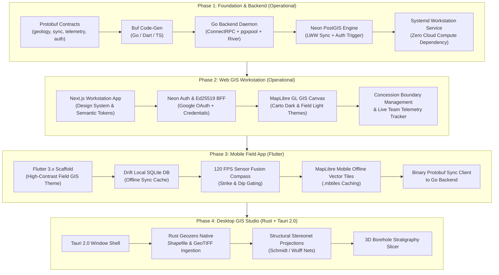

# 🗺️ GeoQuerry — Master Project Plan, Progress & Architecture Guide

> **Current Status**: Phase 1 & 2 Active — Go PostGIS Engine (systemd daemon), River durable queue, Neon Auth sync trigger, and Next.js Web GIS Workstation implemented  
> **Repository**: `austin4403/geo-querry` (Remotes: GitLab `origin` & GitHub `github`)  
> **Target Platforms**: Web GIS Workstation, Mobile (iOS & Android Flutter), Desktop Studio (Linux, macOS, Windows)  
> **Author & Lead**: Austin  
> **Last Updated**: September 2026  

---

## 1. What Are We Doing?

### The Mission
Geological exploration, mineral concession management, hydrogeology, and borehole drilling frequently happen in the most remote areas on Earth (e.g., the East African Rift, remote mining blocks, bush exploration camps) where cellular connectivity is intermittent or completely non-existent.

**GeoQuerry** is an **offline-first, cross-platform geological intelligence and field exploration platform**. It replaces fragile paper notebooks, fragmented handheld GPS units, manual Brunton compass recordings, and siloed desktop software with a unified spatial workflow:

1. **In the Bush (Zero Signal)**:
   - Field geologists capture structural orientation (**Strike, Dip, Trend, Plunge**) directly on their phones using 120 FPS hardware sensor fusion (accelerometer + magnetometer) with automated stability gating.
   - Geologists log outcrop stations, rock samples (with local photos), borehole lithology intervals, and vegetation indicators.
   - All spatial records are indexed locally in SQLite with vector map rendering (`.mbtiles`) without requiring any network connection.

2. **At Camp or Base (Low Bandwidth / 2G / Satellite / Starlink)**:
   - The device syncs bidirectionally using binary **Protocol Buffers** (reducing payload size by ~75% vs JSON).
   - High-resolution sample and vegetation photos are uploaded directly to **Cloudflare R2** with zero egress fees via secure presigned URLs.
   - Background telemetry streams live team coordinates and battery statuses when online.

3. **In the Office / Exploration HQ**:
   - Exploration managers view concessions and live geologist tracks on the **Web GIS Workstation** (MapLibre GL JS Carto Dark Matter / Light Mode themes).
   - Team authentication with **Neon Auth (Managed Better Auth)** and Google OAuth, backed by Ed25519 internal assertions and automatic database trigger synchronization into `public.users` and `organization_memberships`.
   - Lead geoscientists open **Desktop GIS Studio** (Rust + Tauri 2.0) to slice massive multi-gigabyte shapefiles, plot structural stereonets, and render 3D borehole log stratigraphy without browser memory limits.
   - Dual-currency billing handles subscriptions via **Safaricom M-Pesa STK Push (KES)** for local African operations and **Paystack / Stripe (USD/Cards)** globally.

---

## 2. Tech Stack Blueprint

### A. Universal Data Contract Layer
* **Protocol Buffers (Proto3)**: Canonical definition for all domain entities, sync payloads, and streaming telemetry (`proto/geoquerry/v1/*.proto`).
* **Buf**: Protobuf linting, breaking change detection, and multi-language code generation (`buf.yaml`, `buf.gen.yaml`).
* **ConnectRPC / gRPC**: High-performance binary transport compatible with HTTP/1.1, HTTP/2, gRPC-Web, and standard REST clients.

### B. Backend Engine (Local & Workstation Daemon)
* **Language**: Go (Golang 1.25+)
* **RPC Framework**: Connect-Go (`connectrpc.com/connect`) & standard `net/http` / Chi router
* **Database Driver**: `jackc/pgx/v5` with connection pooling (`pgxpool`)
* **Durable Background Queue**: River queue engine for asynchronous GIS processing and audit jobs
* **Session & Identity**: Ed25519 assertion verifier converting BFF session claims into authenticated ConnectRPC identities
* **Object Storage**: AWS SDK for Go v2 configured for Cloudflare R2 (S3-compatible presigned PUT/GET)
* **Real-time Telemetry Hub**: Goroutines + WebSockets / SSE backed by pub/sub
* **Deployment Runtime**: Native **Linux systemd user daemon** (`geoquerry-backend.service`) running on `:8080` (zero external cloud compute dependencies, ultra-low latency, and local machine security).

### C. Database & Spatial Infrastructure
* **Engine**: PostgreSQL 16+ on **Neon Serverless Postgres**
* **Spatial Extension**: **PostGIS 3.4+**
* **Auth Schema**: `neon_auth` with real-time sync trigger (`on_neon_auth_user_sync`) synchronizing identities to `public.users` and provisioning tenant access in `public.organization_memberships`.
* **Key Spatial Types**:
  - `GEOMETRY(PointZ, 4326)`: Outcrop stations and borehole collar coordinates with elevation
  - `GEOMETRY(MultiPolygon, 4326)`: Concession boundaries and exploration claims
* **Indexing**: Spatial `GIST` indexes on all geometry columns, composite indexes on `(project_id, updated_at)` for delta-sync queries.

### D. Mobile Field App (Field Geologist Tool)
* **Framework**: Flutter 3.x (Dart) targeting iOS & Android
* **Hardware Sensors**: `sensors_plus` consuming accelerometer and magnetometer streams at 120 FPS; complementary/kalman filtering to compute strike, dip, trend, plunge with tilt compensation and visual stability indicator.
* **Local Persistence**: **Drift (type-safe SQLite)** with migration handling, dirty entity tracking (`is_dirty`, `synced_at`), and Last-Write-Wins (LWW) conflict resolution.
* **Offline Mapping**: `maplibre_gl` (Flutter) loading offline `.mbtiles` packages containing vector contours, satellite basemaps, and geological boundary layers.
* **Serialization**: Dart Protobuf runtime for high-density, low-bandwidth data transfers.

### E. Web GIS Workstation (Management & Concession Portal)
* **Framework**: Next.js 16+ (App Router) + TypeScript
* **Styling**: Tailwind CSS v4 with semantic tokens supporting **Carto Dark Matter** (`#09090b` obsidian background) and **Field Day Mode** (`#ffffff` high contrast) with instant `ThemeToggle`.
* **Map Engine**: MapLibre GL JS + PostGIS vector rendering
* **Authentication**: Neon Auth client & server BFF with Google OAuth, email credentials, fast test personas, and 15-minute sudo elevation.
* **ConnectRPC Client**: Browser ConnectRPC client calling Go backend on `:8080`.
* **Hosting**: Workstation local server (`:3001`) / Cloudflare Pages.

### F. Desktop GIS Studio (Heavyweight Workstation)
* **Shell**: Tauri 2.0 (Rust)
* **Native Rust Processing Engine**:
  - `geozero` & `geo`: Fast spatial geometry manipulation, shapefile/GeoTIFF ingestion.
  - `polars`: High-throughput tabular crunching for dense drillhole assay CSVs and LAS borehole logs.
  - Native stereonet generator (Wulff & Schmidt net projections) and cross-section interpolation.
* **Frontend**: Shared React/Next.js UI components running in Tauri webview with native IPC bridge.

### G. Zero-Cost Infrastructure Matrix ($0.00 / month)
| Service | Provider | Tier Allocation | Role |
| :--- | :--- | :--- | :--- |
| Version Control | GitLab (`origin`) & GitHub (`github`) | Unlimited free repos & CI runners | Dual-remote version control & CI/CD |
| Spatial Database & Auth | Neon Postgres | Free tier, PostGIS enabled + Neon Auth | Canonical relational and spatial database + OAuth identity |
| Backend Engine | Local Host / Systemd User Daemon | Local CPU/RAM (`:8080`) | Go ConnectRPC sync engine, River queue, telemetry hub |
| Web GIS Workstation | Next.js Engine (`:3001`) | Local Workstation / Cloudflare Pages | Interactive concession mapping, telemetry, and analysis |
| Blob / Photo Storage | Cloudflare R2 | 10 GB free, $0 egress fees | Sample outcrop and vegetation photos |

---

## 3. Monorepo Folder Structure

```
geo-querry/
├── .git/                                # Git version control (GitLab + GitHub remotes)
├── .gitlab-ci.yml                       # GitLab CI/CD pipeline (Test, Lint, Audit)
├── GEOQUERRY_SYSTEM_DESIGN.md           # Master System Architecture & Specifications
├── PROJECT_PLAN.md                      # Master Plan, progress, folder structure, tech stack
├── README.md                            # High-level repository entrypoint
│
├── proto/                               # Universal Protobuf Contracts
│   ├── buf.yaml                         # Buf v2 module configuration
│   ├── buf.gen.yaml                     # Buf code-gen config (Go, Dart, TypeScript)
│   └── geoquerry/
│       └── v1/
│           ├── geology.proto            # Stations, Measurements, Samples, Boreholes, Concessions, Vegetation
│           ├── sync.proto               # PushSyncQueue & PullProjectData delta payloads
│           ├── telemetry.proto          # Real-time GPS, heading, battery, and speed streaming
│           ├── auth.proto               # ExchangeAssertion, VerifySudo, GetSessionContext
│           └── service.proto            # GeoquerrySyncService RPC definitions
│
├── backend/                             # Compiled Go Backend Daemon
│   ├── bin/
│   │   └── server                       # Native compiled Go binary managed by systemd
│   ├── go.mod                           # Go module definition
│   ├── go.sum                           # Go dependencies checksum
│   ├── cmd/
│   │   ├── server/                      # Server entrypoint (HTTP/ConnectRPC listener on :8080)
│   │   ├── seed/                        # Idempotent DB seeder
│   │   └── bench-telemetry/             # Telemetry streaming load tester
│   ├── internal/
│   │   ├── auth/                        # Ed25519 verifier, context interceptor, identity resolver
│   │   ├── config/                      # Environment configuration loader
│   │   ├── db/                          # pgxpool connection manager for Neon PostGIS
│   │   ├── sync/                        # PushSyncQueue & PullProjectData RPC business logic + LWW
│   │   ├── telemetry/                   # Real-time geologist location pub/sub & stream fanout
│   │   ├── mpesa/                       # Safaricom M-Pesa STK push & webhook handling
│   │   ├── paystack/                    # Paystack checkout & webhook handling
│   │   └── r2/                          # Cloudflare R2 S3 presigned URL generator
│   ├── migrations/                      # Embedded database migrations
│   │   ├── 000001_init.sql              # PostGIS tables, GIST indices, foreign keys
│   │   ├── 000002_organizations.sql     # Multi-tenant organizations & memberships
│   │   ├── 000003_audit_trail.sql       # Immutable GIS audit logging
│   │   ├── 000004_river_queue.sql       # River durable background queue schema
│   │   ├── 000005_fix_column_names.sql  # Schema alignment migrations
│   │   └── 000006_neon_auth_sync.sql    # Real-time neon_auth -> public.users sync trigger
│   └── pkg/
│       └── proto/                       # Generated Go Protobuf & ConnectRPC code
│
├── web/                                 # Next.js Collaborative Web GIS Workstation
│   ├── package.json                     # Next.js 16, MapLibre GL, Tailwind CSS v4, Lucide React
│   ├── app/
│   │   ├── globals.css                  # Semantic design tokens (Dark Matter & High-Contrast Light)
│   │   ├── layout.tsx                   # Workstation root layout
│   │   ├── page.tsx                     # Landing page & exploration overview
│   │   ├── login/                       # Themed Auth portal (Google OAuth, credentials, fast personas)
│   │   ├── dashboard/                   # Main GIS control panel & concession explorer
│   │   ├── concessions/                 # Concession polygon manager and license expiry monitor
│   │   └── api/
│   │       └── auth/                    # Better Auth BFF endpoint proxy
│   ├── components/
│   │   ├── ui/                          # Button, Input, Card, Badge, ThemeToggle
│   │   ├── gis/                         # MapLibreCanvas, StructuralLayers, ConcessionPolygonLayer
│   │   └── icons/                       # GeoQuerry SVG brand assets
│   └── lib/
│       ├── auth/                        # Neon Auth client & server configs
│       ├── session.ts                   # Sudo elevation & session state resolvers
│       └── rpc/                         # ConnectRPC client calling Go backend (:8080)
│
├── mobile/                              # Flutter Cross-Platform Field App (iOS & Android)
│   ├── pubspec.yaml                     # Drift SQLite, sensors_plus, maplibre_gl, protobuf
│   └── lib/                             # Compass sensor fusion (120 FPS), offline vector maps, sync client
│
└── desktop/                             # Tauri 2.0 Workstation GIS Studio
    ├── src-tauri/                       # Rust engine: geozero, polars, stereonets, LAS borehole slicer
    └── src/                             # Workstation UI views
```

---

## 4. Current File Progress & Implementation Audit

| Component | Status | Details |
| :--- | :---: | :--- |
| **Database & Migrations** | | |
| `000001_init.sql` to `000005_fix_column_names.sql` | ✅ Complete | PostGIS tables: `projects`, `concessions`, `stations`, `structural_measurements`, `rock_samples`, `vegetation`, `boreholes`, `borehole_intervals` with GIST indices + audit trails + River queue. |
| `000006_neon_auth_sync.sql` | ✅ Complete | Real-time PostgreSQL trigger (`on_neon_auth_user_sync`) syncing `neon_auth."user"` to `public.users` and provisioning `organization_memberships` (Turkana Gold Ltd). |
| **Backend Engine (`backend/`)** | | |
| `backend/cmd/server/main.go` | ✅ Complete | HTTP & ConnectRPC bootstrap: DB connect, River queue engine, CORS, request logging, `/healthz`, `/livez`, `/readyz`. |
| `backend/internal/auth/service.go` | ✅ Complete | `ExchangeAssertion`, `VerifySudo`, and `GetSessionContext` ConnectRPC handlers with fallback identity resolution. |
| `backend/internal/sync/service.go` | ✅ Complete | `PushSyncQueue` & `PullProjectData` handlers with LWW conflict resolution and delta-sync protection. |
| `backend/internal/telemetry/hub.go` | ✅ Complete | In-memory real-time pub/sub hub with coordinate TTL and broadcast streams. |
| `systemd` Daemon Configuration | ✅ Complete | Managed as active systemd user service (`geoquerry-backend.service`) running on `:8080`. |
| **Web GIS Workstation (`web/`)** | | |
| `web/app/login/page.tsx` | ✅ Complete | Re-themed workstation login matching original application design tokens; Google OAuth, credentials, fast personas, theme toggle. |
| `web/app/dashboard/page.tsx` | ✅ Complete | Full GIS workstation dashboard with live user session profile, PostGIS concession data, and MapLibre canvas. |
| `web/components/ui/` | ✅ Complete | Semantic design system: `button.tsx`, `card.tsx`, `badge.tsx`, `input.tsx`, `theme-toggle.tsx`. |
| `web/lib/auth/` | ✅ Complete | Neon Auth client & server initialization with Ed25519 token assertions. |
| **Mobile App (`mobile/`)** | ⏳ Pending | Flutter setup (`pubspec.yaml`), Drift SQLite schema, `sensors_plus` compass dial, MapLibre GL offline vector map. |
| **Desktop Studio (`desktop/`)** | ⏳ Pending | Tauri 2.0 Rust setup (`Cargo.toml`), Shapefile parser with `geozero`, structural stereonets. |

---

## 5. Execution Roadmap & Milestones



### Next Immediate Action Items
1. **Field Data Capture in Web Workstation**:
   - Add Station and Outcrop form creation tools with interactive map pin placement.
   - Wire structural measurement inputs (strike, dip, rock type) directly to PostGIS via ConnectRPC.
2. **Mobile App Prototype (`mobile/`)**:
   - Generate Dart protobuf models via `buf generate`.
   - Setup Drift SQLite schema matching `000001_init.sql` for offline data recording in the field.
3. **Photo Storage Integration**:
   - Implement Cloudflare R2 presigned upload endpoint in Go backend for geological sample photographs.
