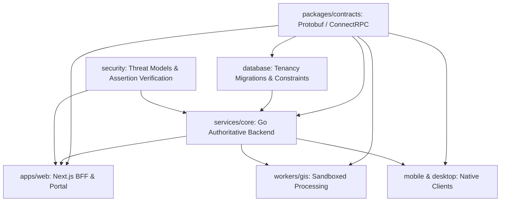

# Architecture Dependency Graph and Implementation Sequence

## 1. Monorepo Dependency Graph

## 2. Implementation Sequence by Waves

### Wave 0 — Architecture Decisions, Threat Modeling, and Core Contracts (Current Wave)
- **Subagents Active**:
  1. Architecture & Integration Lead
  2. Security, Identity, and Audit Lead
  3. API and ConnectRPC Contract Lead
  4. Database, Tenancy, and Migration Engineering Lead
- **Outputs**:
  - ADRs 0001 through 0007.
  - Threat models, token assertion specification, security controls.
  - Protobuf definitions (`packages/contracts/v1/`).
  - Database migrations (`database/migrations/`) with composite tenant keys, spatial schemas, durable River queue tables, billing ledgers, and audit models.
  - Advisory-lock migration runner and seed fixtures.

### Wave 1 — Foundational Implementation
- **Subagents Active**:
  5. Go Core Authorization and Domain Services
  6. Next.js BFF, Session Handling, and Route Protection
  7. Infrastructure, CI/CD, and Observability
  8. Design System and Accessibility Primitives
- **Deliverables**:
  - Ed25519 token issuance in Next.js BFF and token validation interceptor in Go.
  - Go tenant-context resolver and strict RBAC permission service.
  - Edge session cookie management and CSRF defense in Next.js.
  - Cloudflare deployment configs and container manifests.
  - Tailwind v4 theme tokens, accessible button, inputs, and layout shells.

### Wave 2 — Domain Implementation
- **Subagents Active**:
  9. Payments, Subscriptions, and Entitlements
  10. GIS Ingestion and Spatial Integrity Sandbox
  11. Durable Jobs, Offline Sync, and Telemetry
  12. Marketing and Portal Product UI
- **Deliverables**:
  - M-Pesa Daraja and Stripe webhooks with durable inbox and reconciliation worker.
  - Sandboxed parser for Shapefiles, GeoTIFFs, CWLS LAS, and LAS/LAZ point clouds.
  - River queue handlers for offline synchronization and stream replay.
  - Accessible marketing bento grid and authenticated GIS portal views.

### Wave 3 — Verification and Release
- **Subagents Active**:
  13. Security Verification (Adversarial Penetration Testing)
  14. Quality, Performance, and Release Engineering
  15. Architecture Lead Final Reconciliation
- **Deliverables**:
  - Penetration testing against BOLA, cross-tenant isolation, replay attacks.
  - Automated performance benchmarks (p95 / p99 latencies).
  - End-to-end vertical slice release sign-off.
